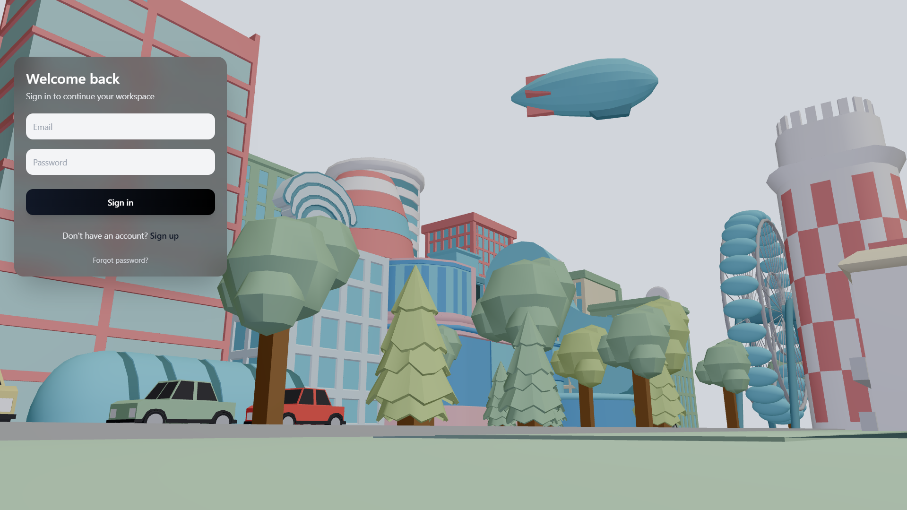

# 🌌 ENTRYVERSE

> Enter systems through experience, not forms.

---

## Overview

**ENTRYVERSE** is a cinematic authentication interface that transforms traditional login flows into **immersive digital entry points**.

Instead of static forms, users are welcomed into a **living 3D environment** — where interaction feels natural, fluid, and intentional.

---

##  Preview

<<<<<<< HEAD
<p align="center">
  
</p>
=======

>>>>>>> 4e1c7a91b9e178150ba66dfc640df9c459e0fa82

---


---

##  Why Entryverse?

Modern interfaces are fast.
But they are not memorable.

Entryverse is built on a simple idea:

> Authentication should feel like entering a world — not filling a form.

---

##  Core Experience

*  A persistent 3D city scene exists before interaction
*  Glassmorphism UI floats above the environment
*  Transitions feel cinematic, not mechanical
*  Modals behave like layered system states

---

##  Features

###  Cinematic Interface

* Minimal, distraction-free login panel
* Glass blur + depth layering
* Smooth hover & micro-interactions
* Modal-based flows (Reset / Sign Up)

---

###  Real-Time 3D Scene

* Low-poly animated city (`.glb`)
* Animation playback via `useAnimations`
* Optimized rendering with lazy loading
* Scene mounted using React Three Fiber

---

###  Authentication Flow (UI Layer)

* Email & password validation
* Password reset interaction
* AAA-style account creation flow
* Real-time feedback states

---

###  Performance Architecture

* `next/dynamic` (SSR disabled for 3D)
* Suspense-based loading strategy
* GLTF preloading for stability
* Lightweight component separation

---

##  Tech Stack

* **Next.js (App Router)**
* **React**
* **TailwindCSS**
* **@react-three/fiber**
* **@react-three/drei**
* **Three.js**

---

##  Project Structure

```
/app
  page.jsx

/components
  /canvas
    City.jsx
    View.jsx

/public
  /models
    city.glb
  preview.gif
```

---

##  Installation

```bash
git clone https://github.com/your-username/entryverse.git
cd entryverse
npm install
npm run dev
```

---

##  Usage

After running the project:

* Open `http://localhost:3000`
* Interact with the login panel
* Explore modal flows:

  * Sign Up
  * Reset Password

---

##  Rendering Flow

```txt
View (Canvas)
 ├── City (GLTF Scene)
 ├── Common (Lighting / Setup)
 └── UI Layer (HTML Overlay)
```

---

##  Architecture Insight

* **UI and 3D are fully decoupled**
* Canvas runs independently from DOM
* Authentication logic is modular
* Easily extendable into real backend systems

---

##  Future Improvements

*  Real authentication integration (JWT / OAuth)
*  Scene variations (day/night / themes)
*  Camera transitions based on interaction
*  Full mobile gesture optimization
*  AI-assisted UI states

---

##  Deployment

You can deploy easily using:

* Vercel
* Netlify
* Any Node-compatible hosting

---

##  Use Cases

* SaaS login systems
* Portfolio showcase
* UI/UX concept demonstrations
* Product onboarding experiences

---

##  Disclaimer

This project focuses on **frontend experience and interaction design**.
Authentication logic is currently simulated.

---

##  Author

**Cihan Sarı**

* GitHub: https://github.com/ChnSari
* LinkedIn: https://linkedin.com/in/cihansri
* Email: [cihannsri@gmail.com](mailto:cihannsri@gmail.com)

---

##  License

MIT License

---

##  Final Note

ENTRYVERSE is not just a UI component.

It is a concept:

> The future of authentication is experiential.
